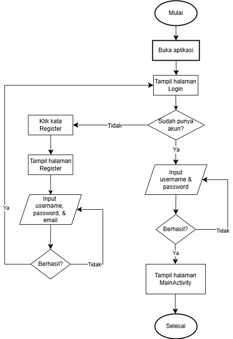
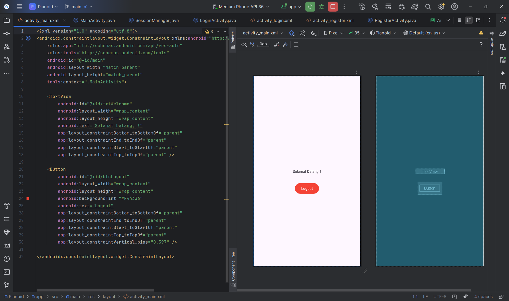
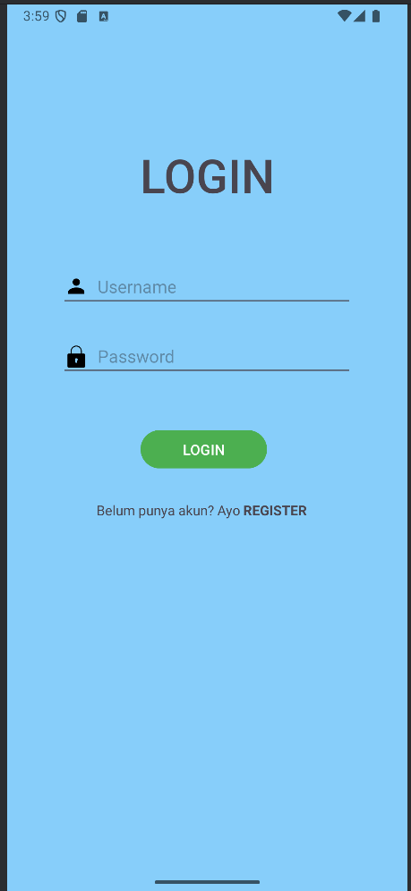
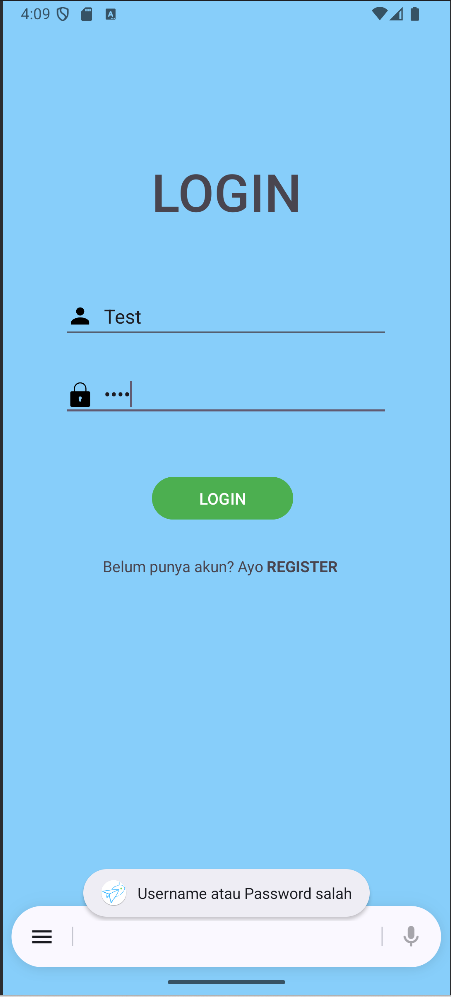
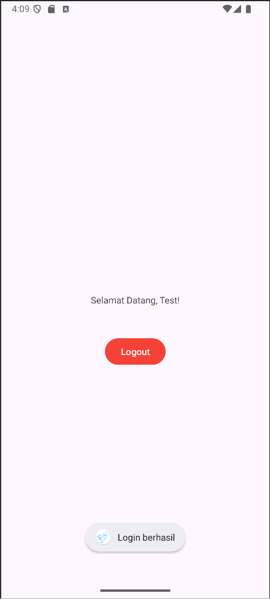
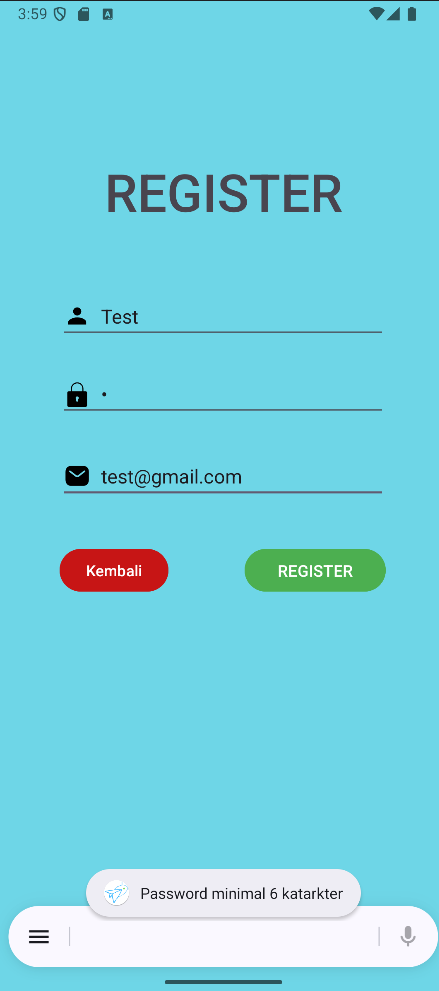
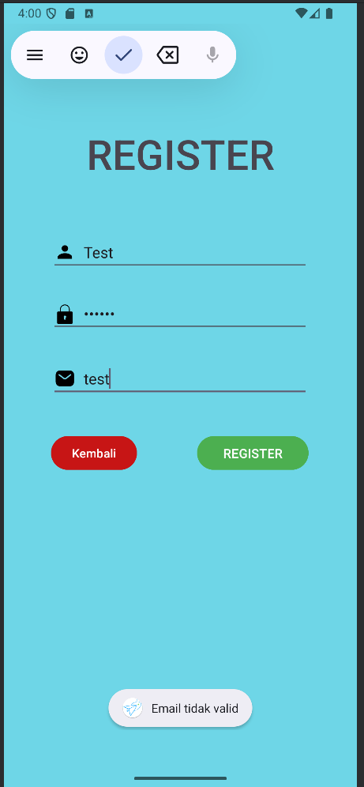
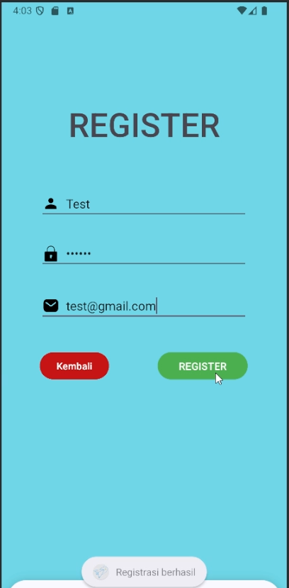
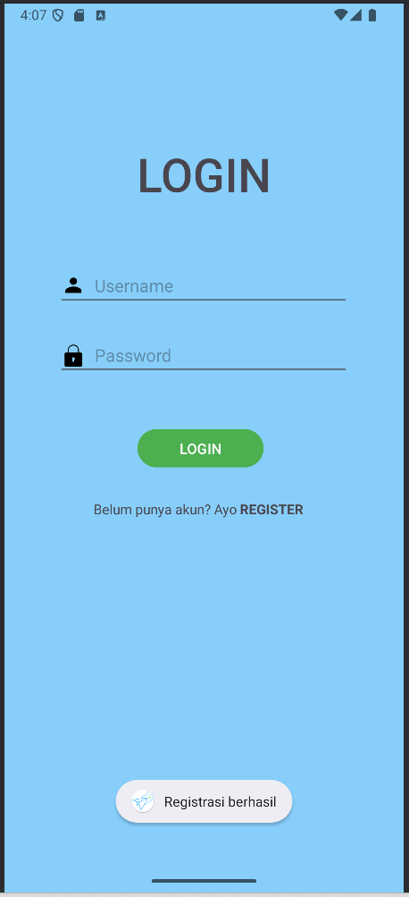
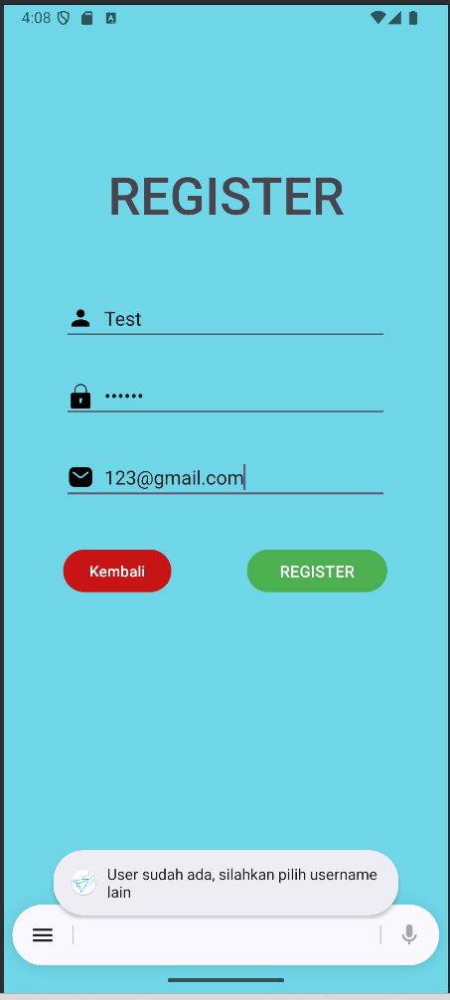

# Pemrograman4-UMB
Aplikasi Android sederhana dengan fitur Login dan Register

## Fitur Aplikasi
---
- **Register**: Untuk membuat akun baru.
- **Login**: Untuk masuk ke aplikasi dengan akun yang sudah didaftarkan.
- **Main Activity**: Tampilan utama berupa "Selamat Datang, Username!".
- **Logout**: Untuk keluar dari akun dan kembali ke tampilan login.

## Tools yang digunakan
---
- Bahasa: Java
- Backend: HTTP REST API dengan PHP

## Alur Login & Register
---

## Screenshots Tampilan
---

## HASIL UJI COBA EMULATOR
---
Fungsionalitas Login & Main Activity
---
    

Fungsionalitas Register
---
       
            

## DATA DIRI
---
Nama: Bayu Sebastian
  NIM: 220320001
  Prodi: Informatika

### Note
---
Ubah code "your-ip-address" pada file koneksi.java dan network_security_config.xml dengan ip address device anda sendiri.

